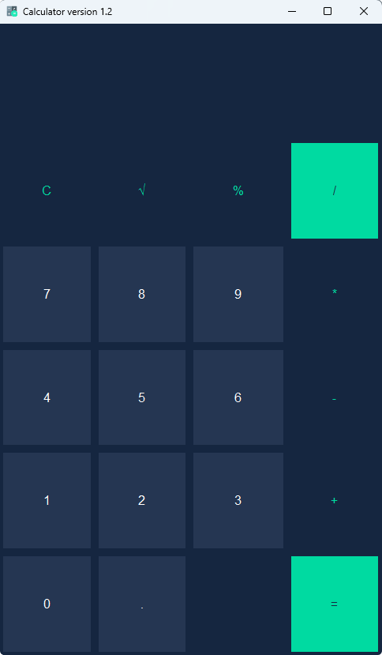

# Python Calculator with Graphical Interface

¡Welcome to my Python calculator project! This calculator was developed as part of my portfolio to demonstrate my skills in programming, graphical interface design and handling of mathematical logic.

## 🚀 Main features

- **Modern graphical interface**: Designed with `tkinter`, the calculator has an intuitive and attractive interface.
- **Basic operations**: Supports addition, subtraction, multiplication and division.
- **Square root**: Includes square root function (`√`).
- **Decimal handling**: Allows operations with decimal numbers.
- **Input validation**: Avoid invalid input and handle errors elegantly.
- **Keyboard support**: You can use both the mouse and the keyboard to interact with the calculator.

## 📸 Captura de pantalla

## 🛠️ Technologies used

- **Python**: Primary programming language.
- **Tkinter**: Library to create the graphical interface.
- **Math**: Module for advanced mathematical operations (such as the square root).
- **Re**: Regular expressions to validate and transform input.
